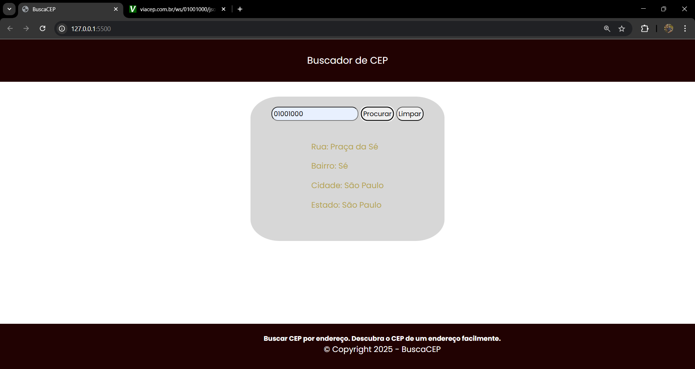

# Projeto buscador de CEPs
Pesquisar CEPs utilizando de uma API, chamada: https://viacep.com.br/, com intuito educacional.

## Design do projeto



## API utilizada
A api https://viacep.com.br/ retorna um Json contendo as seguintes informações para um CEP de exemplo: 01001000

// https://viacep.com.br/ws/01001000/json/
```
{
"cep": "01001-000",
"logradouro": "Praça da Sé",
"complemento": "lado ímpar",
"unidade": "",
"bairro": "Sé",
"localidade": "São Paulo",
"uf": "SP",
"estado": "São Paulo",
"regiao": "Sudeste",
"ibge": "3550308",
"gia": "1004",
"ddd": "11",
"siafi": "7107"
}
```
## Funcionalidades
- [x] Busca CEPs;
- [x] Limpar dados;
- [x] Rodapé;
- [ ] Melhorado o design;
- [ ] Responsividade.

## Observações
> [!NOTE]
> Projeto feito na disciplina de Programação Web I do curso Análise e Desenvolvimento de Sistemas do Instituto Federal do Ceará de Jaguaruana.

> [!IMPORTANT]
> Alguns CEPs podem não conter todas infirmações visto que algumas cidades, por serem pequenas, tem um CEP só para todo o seu território. 

## Contatos
guilhermerochasilva019@gmail.com
